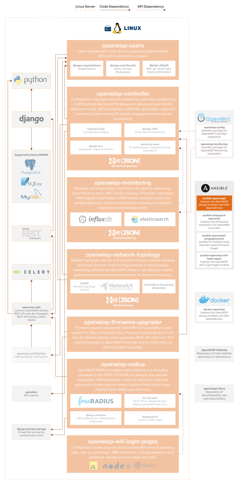

Ansible OpenWISP
================

.. seealso::

    **Source code**: `github.com/openwisp/ansible-openwisp2
    <https://github.com/openwisp/ansible-openwisp2>`_.

This ansible role allows deploying the OpenWISP Server Application.

**Recommended minimum ansible core version**: 2.13.

Tested on **Debian (Trixie/Bookworm)**, **Ubuntu (24/22 LTS)**.

The following diagram illustrates the role of the Ansible OpenWISP role
within the OpenWISP architecture.

    **OpenWISP Architecture: highlighted Ansible OpenWISP role**

.. important::

    For an enhanced viewing experience, open the image above in a new
    browser tab.

    Refer to :doc:`/general/architecture` for more information.

.. toctree::
    :caption: Ansible OpenWISP Usage Docs
    :maxdepth: 1

    ./user/system-requirements.rst
    ./user/quickstart.rst
    ./user/certbot-ssl.rst
    ./user/enabling-modules.rst
    ./user/deploying-wpa-eap-ttls-pap.rst
    ./user/deploying-custom-static-content.rst
    ./user/configuring-cors-headers.rst
    ./user/installing-on-vm.rst
    ./user/troubleshooting.rst
    ./user/role-variables.rst

.. toctree::
    :caption: Ansible OpenWISP Developer Docs
    :maxdepth: 1

    ./developer/installation.rst
